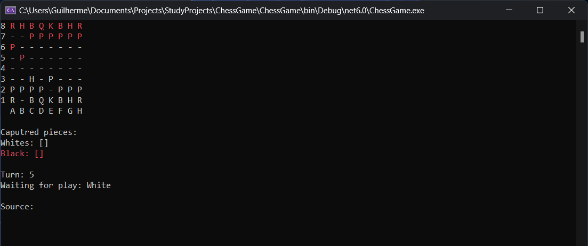

# ChessGame



### Jogo de xadrez no console

Um dos objetivos do projeto é aplicar conceitos da linguagem c# orientada a objetos para a construção do jogo, contemplando todas as jogadas inclusives jogadas especiais do xadrez.

## 🛠 Tecnologias e Frameworks
- [.NET 6](https://dotnet.microsoft.com/en-us/download/dotnet/6.0)

## 🎲 Executando a aplicação
```bash
# Clone este repositório ou faça o download .zip e extraia os arquivos
$ git clone <https://github.com/GuilhermeAFerrari/ChessGame.git>

# Acesse o arquvio ChessGame.sln com o Visual Studio e execute a aplicação console (CRTL+F5) ou acesse a pasta ChessGame e execute o camando dotnet run pelo terminal
```

## Features
- Todas jogadas
- Aviso em cheque
- Jogadas especiais

## 😎 Autor
- Guilherme Ferrari
- E-mail: guile.ferrari@hotmail.com
- [](https://www.linkedin.com/in/guilherme-antonio-ferrari/)
